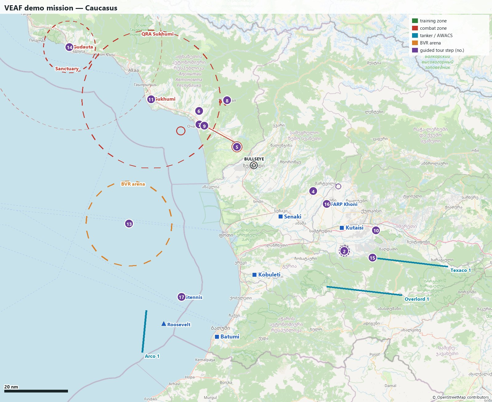

🇫🇷 *Ce document existe aussi [en français](README.md).*

# VEAF demo mission (Caucasus)

The demonstration mission of the [VEAF Mission Creation Tools](https://github.com/VEAF/VEAF-Mission-Creation-Tools) v6: **every feature has its example here**, and an in-game **guided tour** leads from one to the next.
It is updated with every new feature, and checked before every release of the tools: if a feature works here, it works.

### What are the VMCT?

The **VEAF Mission Creation Tools** (VMCT) are the toolkit the [VEAF](https://www.veaf.org) uses to build its DCS World missions.
They bring the in-game scripts (spawning units from F10 map markers, combat zones, QRA, CAP on demand, tankers and AWACS, carrier operations, Skynet air defence, CTLD and CSAR…) and the `veaf-tools` command line that builds a mission from a folder: the DCS mission, a `mission.yaml` that configures every module, radio presets, waypoints, weather variants.
[Documentation](https://veaf.github.io/documentation/latest/en/) · [Repository](https://github.com/VEAF/VEAF-Mission-Creation-Tools)



## Getting started

1. Download the mission in the language and weather of your choice (latest [release](https://github.com/VEAF/VEAF-Demo-Mission-v6/releases/latest)), and copy it into `Saved Games\DCS\Missions`; or build it (see [For mission makers](#for-mission-makers)).
2. Run it solo or on a server, and take a slot at **Kutaisi** (classic slots, hot start) or on a carrier.
3. Open **F10 > Other > Guided tour**: one submenu per chapter, one entry per step. Each entry shows what to do, where the step is relative to you, and places a mark on your F10 map.

VEAF security is **disabled** in this mission: every command is open to everyone, including those a server keeps for qualified pilots.
The mission comes in **two complete versions**, English (`_EN`) and French (`_FR`): VEAF and CTLD menus, guided tour, demo menus, briefing, F10 map and briefing maps are all in the version's language.
This guide follows the English version.

| Weather | French | English |
|---|---|---|
| morning, real Kutaisi weather | [matin-reel_FR.miz](https://github.com/VEAF/VEAF-Demo-Mission-v6/releases/latest/download/VEAF_Demo_Mission_Caucasus_ICAO_UGKO_FR_matin-reel.miz) | [morning-real_EN.miz](https://github.com/VEAF/VEAF-Demo-Mission-v6/releases/latest/download/VEAF_Demo_Mission_Caucasus_ICAO_UGKO_EN_morning-real.miz) |
| morning, clear sky | [matin-degage_FR.miz](https://github.com/VEAF/VEAF-Demo-Mission-v6/releases/latest/download/VEAF_Demo_Mission_Caucasus_ICAO_UGKO_FR_matin-degage.miz) | [morning-clear_EN.miz](https://github.com/VEAF/VEAF-Demo-Mission-v6/releases/latest/download/VEAF_Demo_Mission_Caucasus_ICAO_UGKO_EN_morning-clear.miz) |
| dawn, scattered clouds | [aube-epars_FR.miz](https://github.com/VEAF/VEAF-Demo-Mission-v6/releases/latest/download/VEAF_Demo_Mission_Caucasus_ICAO_UGKO_FR_aube-epars.miz) | [dawn-scattered_EN.miz](https://github.com/VEAF/VEAF-Demo-Mission-v6/releases/latest/download/VEAF_Demo_Mission_Caucasus_ICAO_UGKO_EN_dawn-scattered.miz) |
| evening, rain | [soir-pluie_FR.miz](https://github.com/VEAF/VEAF-Demo-Mission-v6/releases/latest/download/VEAF_Demo_Mission_Caucasus_ICAO_UGKO_FR_soir-pluie.miz) | [evening-rain_EN.miz](https://github.com/VEAF/VEAF-Demo-Mission-v6/releases/latest/download/VEAF_Demo_Mission_Caucasus_ICAO_UGKO_EN_evening-rain.miz) |
| night, clear sky | [nuit-degage_FR.miz](https://github.com/VEAF/VEAF-Demo-Mission-v6/releases/latest/download/VEAF_Demo_Mission_Caucasus_ICAO_UGKO_FR_nuit-degage.miz) | [night-clear_EN.miz](https://github.com/VEAF/VEAF-Demo-Mission-v6/releases/latest/download/VEAF_Demo_Mission_Caucasus_ICAO_UGKO_EN_night-clear.miz) |

### Typing a command into a marker

Many features are driven from the F10 map: "Add mark" button in the top bar, click on the map, type the command text (for example `-sa8`), then click elsewhere to validate.
The command runs at the marker's position, and the marker disappears.

## The theatre

The front follows the Inguri river, between Georgia (blue) and Abkhazia (red). The bullseye, shared by both sides, is on **Zugdidi**.

| Blue base | Slots | Note |
|---|---|---|
| Kutaisi | classic (hot start) + dynamic | home base, defended by a NASAMS |
| Senaki-Kolkhi | dynamic | defended by a Hawk; target of the scripted raid |
| Kobuleti | dynamic | |
| Batumi | dynamic | |
| Carriers Stennis, Roosevelt | F/A-18C, F-14B (deck, hot start) | off Batumi |
| FARP Khoni | — | helicopters, CTLD, CSAR |

Every Russian and Abkhazian airfield is red, without slots. Dynamic slots only work in multiplayer.

| Asset | Frequency | TACAN | Altitude | Where |
|---|---|---|---|---|
| Texaco 1 (KC-135, boom) | 292.0 AM | 52Y | FL200 | east of Kutaisi |
| Arco 1 (KC-135 MPRS, drogue) | 291.0 AM | 51Y | FL180 | south of the carriers |
| Overlord 1 (E-3A) + F-15C escort | 286.0 AM | — | FL300 | south of Kutaisi |
| Reaper 1 (MQ-9, JTAC laser 1511) | 35.55 FM | — | 3,000 m AGL | Gali front |
| CVN-74 Stennis | 274.0 AM | 74X STN, ICLS 4, Link 4 336.0 | — | off Batumi |
| CVN-71 Roosevelt | 271.0 AM | 71X TDR, ICLS 1, Link 4 337.0 | — | off Batumi |
| FARP Khoni | 127.5 AM | — | — | south-west of Khoni |

## The guided tour

| # | Steps | Where | Features |
|---|---|---|---|
| 01 | [Welcome](#01-welcome) | Anywhere (no particular place) | `RADIO`, `build:dynamic_slots`, `build:presets`, `build:waypoints`, `build:weather` |
| 02 | [Sandbox: marker commands](#02-sandbox-marker-commands) | BULLSEYE 127/40 — 7 nm from Kutaisi | `SPAWN`, `SHORTCUTS`, `NAMEDPOINTS`, `GRASS` |
| 03 | [Generated missions: CAS and transport](#03-generated-missions-cas-and-transport) | BULLSEYE 127/40 — 7 nm from Kutaisi | `CASMISSION`, `TRANSPORTMISSION`, `GROUNDAI` |
| 04 | [Khoni training range: three levels](#04-khoni-training-range-three-levels) | BULLSEYE 107/21 — 13 nm from Senaki-Kolkhi | `COMBATZONE`, `AIEN` |
| 05 | [Gali front, and the JTAC drone](#05-gali-front-and-the-jtac-drone) | BULLSEYE 312/8 — 26 nm from Senaki-Kolkhi | `COMBATZONE`, `ASSETS`, `CTLD` |
| 06 | [Integrated air defence (Skynet)](#06-integrated-air-defence-skynet) | BULLSEYE 309/24 — 42 nm from Senaki-Kolkhi | `SKYNET`, `INTERPRETER`, `COMBATZONE` |
| 07 | [Chained mission: Ochamchire port](#07-chained-mission-ochamchire-port) | BULLSEYE 301/21 — 39 nm from Senaki-Kolkhi | `COMBATZONE` |
| 08 | [Operation Tkvarcheli: tasks and dependencies](#08-operation-tkvarcheli-tasks-and-dependencies) | BULLSEYE 332/22 — 40 nm from Senaki-Kolkhi | `COMBATZONE` |
| 09 | [Moving convoy](#09-moving-convoy) | BULLSEYE 303/20 — 38 nm from Senaki-Kolkhi | `COMBATZONE` |
| 10 | [Convoy under fire](#10-convoy-under-fire) | BULLSEYE 112/44 — 11 nm from Kutaisi | `GROUNDAI`, `SPAWN` |
| 11 | [Sukhumi QRA](#11-sukhumi-qra) | BULLSEYE 297/39 — 55 nm from Senaki-Kolkhi | `QRA`, `RADIO` |
| 12 | [Opposition level](#12-opposition-level) | Anywhere (no particular place) | `QRA`, `COMBATMISSION` |
| 13 | [On-demand CAP and the Senaki raid](#13-on-demand-cap-and-the-senaki-raid) | BULLSEYE 297/69 — 85 nm from Senaki-Kolkhi | `COMBATMISSION` |
| 14 | [BVR arena (air waves)](#14-bvr-arena-air-waves) | BULLSEYE 239/44 — 43 nm from Kobuleti | `AIRWAVES`, `RADIO` |
| 15 | [Gudauta red sanctuary](#15-gudauta-red-sanctuary) | BULLSEYE 297/69 — 85 nm from Senaki-Kolkhi | `SANCTUARY` |
| 16 | [Tankers, AWACS and escort](#16-tankers-awacs-and-escort) | BULLSEYE 122/48 — 14 nm from Kutaisi (at mission start) | `ASSETS`, `MOVE` |
| 17 | [Helicopters: FARP, CTLD, CSAR](#17-helicopters-farp-ctld-csar) | BULLSEYE 112/26 — 9 nm from Kutaisi | `CTLD`, `CSAR`, `GRASS` |
| 18 | [Stennis and Roosevelt carriers](#18-stennis-and-roosevelt-carriers) | BULLSEYE 203/48 — 17 nm from Batumi (at mission start) | `CARRIER` |
| 19 | [Weather, ATC and cockpit assistance](#19-weather-atc-and-cockpit-assistance) | BULLSEYE 119/34 — 0 nm from Kutaisi | `WEATHER`, `AIRBASES`, `ASSIST`, `STTS`, `build:weather` |

### 1. Getting started

#### 01 Welcome

This mission shows every feature of the VEAF tools, one per step.
Each step gives the place, what to do and what you should see.
A mark is placed on your F10 map when you open a step.

**Where**: Anywhere (no particular place)

**What to do**:

- VEAF menus are under F10 > Other > VEAF; that menu has several pages ("Next page" at the bottom). The guided tour and the "Demo: commands" menu are separate, directly under F10 > Other.
- Many commands are typed into an F10 map marker: "Add mark" button in the top bar, click on the map, type the text, then click elsewhere to validate.
- Slots: classic hot-start slots at Kutaisi (A-10C II, F-16C, F/A-18C, UH-1H, Mi-8, AH-64D), dynamic slots on the four blue bases in multiplayer; F/A-18C and F-14B on the carriers.

**What you should see**: The VEAF menu and its submenus, and in every aircraft the radio presets and waypoints injected by the build.

**Features**: `RADIO`, `build:dynamic_slots`, `build:presets`, `build:waypoints`, `build:weather` — [Documentation](https://veaf.github.io/documentation/latest/en/mission-maker/GUIDE/)

#### 02 Sandbox: marker commands

The sandbox, south of Kutaisi (named point ALPHA), is where you try the commands typed into an F10 marker: spawn units, a convoy, smoke, a FARP, and wipe it all.

**Where**: BULLSEYE 127/40 — 7 nm from Kutaisi

**What to do**:

- `-sa8`: an SA-8 battery (shipped alias; every alias is listed on the 'Aliases' page of the documentation).
- `-armor`: a random armour group; `-armor, size 4, defense 0` to tune it.
- `_spawn unit, name T-80UD, hdg 270`: a single tank, heading 270.
- `-convoy, dest ALPHA`: a convoy that drives by road to the named point ALPHA (place the marker a few km away).
- `-point BRAVO`: creates your own named point (alias of `_name point BRAVO`), usable in `-convoy, dest BRAVO`.
- `-smoke`: white smoke (`-smoke, color red` for red); `-farp`: a complete FARP with its props.
- `-boum`: a 500 kg explosion; `-menage`: destroys everything within 2 km (two shortcuts defined by this mission).

**What you should see**: Each command answers with a message and spawns what it announces at the marker; the marker disappears once the command has run.

**Features**: `SPAWN`, `SHORTCUTS`, `NAMEDPOINTS`, `GRASS` — [Documentation](https://veaf.github.io/documentation/latest/en/mission-maker/scripts/veafSpawn/) · [Alias list](https://veaf.github.io/documentation/latest/en/ALIASES/)

#### 03 Generated missions: CAS and transport

Two commands build a complete mission where you place the marker: a close air support (CAS) task or a helicopter transport task.

**Where**: BULLSEYE 127/40 — 7 nm from Kutaisi

**What to do**:

- `_cas` (or `_cas, size 3, defense 2`) in a sandbox marker: an enemy group appears in the area, to find and destroy.
- F10 > Other > VEAF > CAS MISSION: target information, smoke, illumination, skip the target.
- `_transport, from ALPHA` in a marker near FARP Khoni (more than 15 km from ALPHA): cargo to pick up at ALPHA and deliver at the marker.
- F10 > Other > VEAF > TRANSPORT MISSION: drop zone position, smoke.

**What you should see**: A menu specific to the generated mission, and a message when the objective is met.

**Features**: `CASMISSION`, `TRANSPORTMISSION`, `GROUNDAI` — [Documentation](https://veaf.github.io/documentation/latest/en/mission-maker/scripts/veafCasMission/)

### 2. Combat zones

#### 04 Khoni training range: three levels

A training range in three levels on the same circle.
Each level includes the one below: medium also spawns the easy targets, hard also spawns the medium ones.

**Where**: BULLSEYE 107/21 — 13 nm from Senaki-Kolkhi

**What to do**:

- F10 > Other > VEAF > COMBAT ZONES > Khoni training > Khoni - easy > Activate zone.
- Destroy the trucks, then deactivate and move on to medium, then hard.
- Zone info, smoke and illumination flare are in the same menu.

**What you should see**: Easy: eight trucks.
Medium: the trucks, an armour company and two AAA pieces drawn among four (never the same twice).
Hard: on top, an armour battalion and two short-range systems drawn at random.

**Features**: `COMBATZONE`, `AIEN` — [Documentation](https://veaf.github.io/documentation/latest/en/mission-maker/scripts/veafCombatZone/)

#### 05 Gali front, and the JTAC drone

A real combat zone on the Inguri front.
Its content is described by carrier units holding a command (#command): the zone spawns in their place one armour group drawn among two, an artillery battery, air defence and MANPADS.
The Reaper 1 drone orbits above and lases the armour.

**Where**: BULLSEYE 312/8 — 26 nm from Senaki-Kolkhi

**What to do**:

- F10 > Other > VEAF > COMBAT ZONES > Gali front > +Activate zone.
- The JTAC: laser code 1511, radio 35.55 FM; F10 > Other > CTLD > JTAC for the current target.
- The drone can be respawned from F10 > Other > VEAF > ASSETS > Reaper 1 (MQ-9, JTAC).

**What you should see**: Only one of the two armour groups appears; the drone announces its target and lases it on code 1511.

**Features**: `COMBATZONE`, `ASSETS`, `CTLD` — [Documentation](https://veaf.github.io/documentation/latest/en/mission-maker/concepts/combat-zones/)

#### 06 Integrated air defence (Skynet)

The red air defence network: an early-warning radar, a permanent SA-11 and SA-15 near Gudauta (placed by #veafInterpreter), plus the Ochamchire SA-6, a combat zone active from the start that joins the network.
Batteries keep their radar off until the network tells them to light up.
Red ground units act as spotters: they see aircraft and relay the alert.

**Where**: BULLSEYE 309/24 — 42 nm from Senaki-Kolkhi

**What to do**:

- Approach Ochamchire from the south-east, low then climbing: watch when your RWR lights up.
- Red IADS status (sites, radars on): F10 > Other > SKYNET IADS COALITION: RED.
- The spotter view belongs to each side: F10 > Other > VEAF > SPOTTER NETWORK > Show the spotter view shows YOUR side's spotters. To see the red network, take the red game master slot of the test mission (reopen the F10 map after clicking).

**What you should see**: The SA-6 stays silent until the network has detected you, then lights up; the SKYNET IADS COALITION: RED menu shows which site is emitting.

**Features**: `SKYNET`, `INTERPRETER`, `COMBATZONE` — [Documentation](https://veaf.github.io/documentation/latest/en/mission-maker/scripts/veafSkynetIadsHelper/)

#### 07 Chained mission: Ochamchire port

Two chained zones: the second does not exist until the first is complete.
First the port depot, then, one minute after it is destroyed, the cargo ships and their corvette at anchor (anti-ship).

**Where**: BULLSEYE 301/21 — 39 nm from Senaki-Kolkhi

**What to do**:

- F10 > Other > VEAF > COMBAT ZONES > Ochamchire port - 1: depot > +Activate zone.
- Destroy the trucks and the ZU-23, then wait one minute.

**What you should see**: Zone 1 completes, and the ships appear offshore without any menu activating them.
Beware: the Sukhumi QRA circle covers Ochamchire.

**Features**: `COMBATZONE` — [Documentation](https://veaf.github.io/documentation/latest/en/mission-maker/scripts/veafCombatZone/)

#### 08 Operation Tkvarcheli: tasks and dependencies

An operation groups several zones as tasks: the radar and the depot first, then the command post, given as an objective only once the first two are destroyed.
All units spawn on activation: the dependency orders the objectives, not the spawning.

**Where**: BULLSEYE 332/22 — 40 nm from Senaki-Kolkhi

**What to do**:

- F10 > Other > VEAF > COMBAT ZONES > Operation Tkvarcheli > +Activate zone: the three tasks appear together.
- The same menu gives the current task; destroy the 1L13 radar and the depot (statics), then the command post.

**What you should see**: Tasks move from "in progress" to "done"; when all three are done, the message "Operation … is over".

**Features**: `COMBATZONE` — [Documentation](https://veaf.github.io/documentation/latest/en/mission-maker/scripts/veafCombatZone/)

#### 09 Moving convoy

A logistics convoy, five trucks and their Shilka, shuttling between Ochamchire and Gali: a moving target.

**Where**: BULLSEYE 303/20 — 38 nm from Senaki-Kolkhi

**What to do**:

- F10 > Other > VEAF > COMBAT ZONES > Ochamchire convoy > +Activate zone.
- Zone info: the convoy position when you ask.

**What you should see**: The convoy drives to Gali, then comes back, in a loop.

**Features**: `COMBATZONE` — [Documentation](https://veaf.github.io/documentation/latest/en/mission-maker/scripts/veafCombatZone/)

#### 10 Convoy under fire

A convoy you send toward an ambush of three red armoured vehicles, east of Kutaisi.
Left to DCS, it would die there without firing; driven by VEAF, it watches, splits, calls for air support and falls back.

**Where**: BULLSEYE 112/44 — 11 nm from Kutaisi

**What to do**:

- Drop a marker in the 'Embuscade' zone with `-convoy, dest EMBUSCADE, side blue`: the convoy takes the road east.
- Follow it on the F10 map; the ambush waits 400 m off the road, 2.8 km further on.
- At contact, read its report, opened by its callsign (Mule, Bison…): 'Bison, contact ahead, 1 enemy at 2290 m bearing 059, engaging'; an F10 marker shows it while the contact lasts.
- Strong enough, it closes in, destroys the ambush, fetches its trucks and drives on by itself.
- Outgunned, it calls for air support (*troops in contact*), marks the enemy with a red smoke and itself with a green one, falls back and holds: `_gc <callsign>, resume` sends it on its way.

**What you should see**: Before the first shot, the trucks leave on their own (the 'unarmed' group), the armed vehicles close in, or fall back when outgunned; the call for help only comes with a fall back.

**Features**: `GROUNDAI`, `SPAWN` — [Documentation](https://veaf.github.io/documentation/latest/en/mission-maker/scripts/veafGroundAI/)

### 3. Air threats

#### 11 Sukhumi QRA

A quick reaction alert (QRA) defends Sukhumi within a 40 km circle that covers Ochamchire.
It answers the threat: one intruder scrambles a pair drawn between MiG-29S and Su-27; three or more, two pairs among Su-30, MiG-31 and MiG-29S.
Three blue players on CAP count as three intruders (next step, the opposition level).
It ignores helicopters.

**Where**: BULLSEYE 297/39 — 55 nm from Senaki-Kolkhi

**What to do**:

- Enter the circle (drawn on the F10 map) in an aircraft: the QRA scrambles 60 s later.
- F10 > Other > Demo: commands > Stop / Start the Sukhumi QRA (a menu declared in YAML).

**What you should see**: A message announces the scramble; the fighters come at you.
Once destroyed, the QRA rearms 5 minutes after the circle is clear of intruders.

**Features**: `QRA`, `RADIO` — [Documentation](https://veaf.github.io/documentation/latest/en/mission-maker/scripts/veafQraManager/)

#### 12 Opposition level

The red fighters scale with the number of players: the mission carries a level, the number of blue aircraft the opposition is sized for, which here follows the players on CAP: those flying with a radar-guided air-to-air missile (Fox 1 or Fox 3), read from what they carry — not the helicopters nor the ground attack.
The Sukhumi QRA takes the tier of the bigger of that level and the intruders in its circle; the on-demand CAPs offer an automatic size, one patrol per two players.

**Where**: Anywhere (no particular place)

**What to do**:

- F10 > Other > VEAF > Opposition > Current level: the level and its mode.
- F10 > Other > VEAF > Opposition > Level > 4 player(s) on CAP: the level goes to 4 and stops following the players; Opposition > Mode > follows the players airborne armed for air-to-air makes it follow again.
- Or by marker: `_opposition 4`, `_opposition air_to_air`.
- F10 > Other > VEAF > MISSIONS > CAP MiG-29S Gudauta FL250 > Good > Auto scale (opposition level).

**What you should see**: Every change of level is announced to all.
At level 4, a single intruder in the Sukhumi circle scrambles two pairs, and "Auto scale" activates the CAP at scale 2.
A pilot who rearms with air-to-air missiles counts as soon as he is airborne again; when a player on CAP lands or leaves, the level drops only after 5 minutes.

**Features**: `QRA`, `COMBATMISSION` — [Documentation](https://veaf.github.io/documentation/latest/en/mission-maker/scripts/veafQraManager/#opposition-level)

#### 13 On-demand CAP and the Senaki raid

Red patrols you spawn from the menu, each a different threat (MiG-29S Fox 3, Su-27 Fox 1, MiG-31), and a scripted mission: two Su-24M escorted by two MiG-29S head out to bomb Senaki.

**Where**: BULLSEYE 297/69 — 85 nm from Senaki-Kolkhi

**What to do**:

- F10 > Other > VEAF > MISSIONS > CAP MiG-29S Gudauta FL250 > Good > scale 1 > Activate mission; same menu for the Excellent level and scale 2.
- F10 > Other > VEAF > MISSIONS > Senaki raid > Good > scale 1 > Activate mission, then intercept the bombers.
- Or by marker: `-airstart Raid-Senaki/Good/1`, `-airstop Raid-Senaki/Good/1` (name, level, size).

**What you should see**: The patrol spawns airborne on its race-track and engages what comes in range; the raid flies to Senaki and bombs the base unless intercepted.

**Features**: `COMBATMISSION` — [Documentation](https://veaf.github.io/documentation/latest/en/mission-maker/scripts/veafCombatMission/)

#### 14 BVR arena (air waves)

An arena off Poti: as soon as a blue aircraft enters, waves of red fighters come one after another, harder each time (a single MiG-29S, two Su-27, two Su-30).

**Where**: BULLSEYE 239/44 — 43 nm from Kobuleti

**What to do**:

- Enter the arena circle (drawn on the F10 map), between 1,000 and 40,000 ft.
- To start over: F10 > Other > Demo: commands > Reset the BVR arena.

**What you should see**: A start message, then a wave; the next comes one minute after the previous is destroyed.
If you die, the arena resets.

**Features**: `AIRWAVES`, `RADIO` — [Documentation](https://veaf.github.io/documentation/latest/en/mission-maker/scripts/veafAirWaves/)

#### 15 Gudauta red sanctuary

A sanctuary protects an area for one side: an enemy pilot who enters is warned, then defences spawn, then the aircraft is shot down.
This one protects Gudauta (15 km) for red; it also destroys missiles fired at units inside it.

**Where**: BULLSEYE 297/69 — 85 nm from Senaki-Kolkhi

**What to do**:

- Fly into the Gudauta circle in a blue aircraft and stay.

**What you should see**: Warning after 10 s, defences deployed at 60 s, aircraft shot down at 120 s.

**Features**: `SANCTUARY` — [Documentation](https://veaf.github.io/documentation/latest/en/mission-maker/scripts/veafSanctuary/)

### 4. Support and logistics

#### 16 Tankers, AWACS and escort

Two tankers (Texaco 1 boom, Arco 1 drogue) and an AWACS (Overlord 1) escorted by two F-15C.
The ASSETS menu respawns them and gives their details; a marker command moves a tanker.

**Where**: BULLSEYE 122/48 — 14 nm from Kutaisi (at mission start)

**What to do**:

- Texaco 1: TACAN 52Y, 292.0 AM, FL200; Arco 1: TACAN 51Y, 291.0 AM, FL180; Overlord 1: 286.0 AM.
- F10 > Other > VEAF > ASSETS > Overlord 1 (E-3A) > Respawn Overlord 1 (E-3A): the AWACS and its escort respawn together.
- Marker `_move tanker, name Texaco 1, alt 22000` where you want the race-track.

**What you should see**: Tankers answer on their frequency and TACAN; after a _move tanker, Texaco 1 flies to its new orbit.

**Features**: `ASSETS`, `MOVE` — [Documentation](https://veaf.github.io/documentation/latest/en/mission-maker/scripts/veafAssets/)

#### 17 Helicopters: FARP, CTLD, CSAR

FARP Khoni rearms and refuels helicopters; its ammo dump is a CTLD loading point (troops and crates).
A downed pilot can be created on demand, to be rescued by helicopter (CSAR).

**Where**: BULLSEYE 112/26 — 9 nm from Kutaisi

**What to do**:

- Take off from Kutaisi in a UH-1H or Mi-8 and land at FARP Khoni (127.5 AM).
- F10 > Other > CTLD: load troops, request a crate, then drop them elsewhere.
- F10 > Other > Demo: commands > Create a downed pilot near Khoni, then the CSAR menu for its beacon and position.

**What you should see**: The FARP refuels and rearms; CTLD loads the troops; the downed pilot transmits a beacon and boards.

**Features**: `CTLD`, `CSAR`, `GRASS` — [Documentation](https://veaf.github.io/documentation/latest/en/mission-maker/GUIDE/)

#### 18 Stennis and Roosevelt carriers

Two carriers off Batumi, each with its S-3B tanker and rescue helicopter.
The CARRIER OPS menu turns the ship into the wind for air operations.

**Where**: BULLSEYE 203/48 — 17 nm from Batumi (at mission start)

**What to do**:

- Stennis: TACAN 74X STN, ICLS 4, Link 4 336.0, tower 274.0 AM. Roosevelt: TACAN 71X TDR, ICLS 1, Link 4 337.0, tower 271.0 AM.
- F10 > Other > VEAF > CARRIER OPS > CARRIER OPS - BLUE > CSG-74 Stennis > +Start carrier air operations for 45 minutes.
- Deck slots: Stennis F/A-18C, Roosevelt F-14B.

**What you should see**: The carrier turns into the wind, speeds up, and the menu gives the recovery course; the S-3B refuels.

**Features**: `CARRIER` — [Documentation](https://veaf.github.io/documentation/latest/en/mission-maker/scripts/veafCarrierOperations/)

#### 19 Weather, ATC and cockpit assistance

A welcome message when you take a slot (base, runway in use, weather), a weather and ATC menu, and for the F-16C a step-by-step start-up checklist.
On a VEAF server, the weather follows Kutaisi's real METAR (UGKO).

**Where**: BULLSEYE 119/34 — 0 nm from Kutaisi

**What to do**:

- Take a slot at Kutaisi: read the welcome message.
- F10 > Other > VEAF > WEATHER AND ATC > Weather on closest point; in the same menu, ATC on closest airbase.
- In the F-16C at Kutaisi: F10 > Other > VEAF > ASSISTANCE > Cold start; then, at the root of the VEAF menu: ASSISTANCE: CONFIRM THE STEP / ASSISTANCE: SKIP THE STEP.

**What you should see**: The welcome message gives the runway in use; the checklist ticks the steps already done.

**Features**: `WEATHER`, `AIRBASES`, `ASSIST`, `STTS`, `build:weather` — [Documentation](https://veaf.github.io/documentation/latest/en/mission-maker/scripts/veafWeather/)

## For mission makers

### Building

From this folder, with `veaf-tools.exe` (installed by `veaf-tools-updater.exe`, see the [documentation](https://veaf.github.io/documentation/latest/en/)):

```
.\veaf-tools.exe mission validate
.\veaf-tools.exe build
python tools/localize_miz.py
python tools/verify.py
```

`build` builds both languages (`build_variants` in `mission.yaml`): in `missions/`, one `_FR` and one `_EN` mission per weather variant of `src/versions.yaml`.
`localize_miz.py` then puts into English what lives in the DCS mission of the `_EN` versions (briefing, F10 labels, briefing maps): without it, `verify.py` rejects the English `.miz`.
For a local test (verbose logs, a single weather, game masters, dcs-bridge): `python tools/make_test_mission.py`, which writes `missions-test/VEAF_Demo_TEST_FR.miz` and `_EN.miz`.

### Files

| File | Role |
|---|---|
| `mission.yaml` | the configuration of every VEAF module, French texts; its end (FR and EN profiles, `build_variants`) is **generated** |
| `i18n/en.yaml` | the English version of every text in `mission.yaml` |
| `src/mission/` | the DCS mission itself, exploded, in French |
| `src/scripts/mission-script.lua` | the mission's own Lua (function behind the "Demo: commands" menu) |
| `src/scripts/guided-tour.lua` | the guided tour, **generated**; it follows the build's language |
| `tour/steps.yaml` | **the source** of the tour, this README and the release checklist, in French and English |
| `tools/` | generators: MCP action batches (`gen_0*.py`), tour and docs (`gen_tour.py`), English profile (`gen_i18n.py`), maps (`gen_map.py`), DCS mission texts in both languages (`i18n_texts.py`), English `.miz` localisation (`localize_miz.py`), checks (`verify.py`) |
| `docs/recette.md` | the pre-release checklist (French), **generated** |

### Adding a feature

Every new VEAF tools feature adds its example to the demo, in the same PR as the feature or right after:

1. place the example in the mission (MCP actions on the folder, or `mission.yaml`);
2. add its step in `tour/steps.yaml`, in French and English, with its release check (`check`);
3. translate every new `mission.yaml` text in `i18n/en.yaml`, then `python tools/gen_i18n.py` (it refuses to run if a translation is missing);
4. `python tools/gen_tour.py` (tour, README, checklist) and `python tools/gen_map.py` (maps);
5. build, `python tools/localize_miz.py`, then `python tools/verify.py`.

### Before every tools release

Build the demo with the release candidate and run [the checklist](docs/recette.md): each line is an in-game observable.
Once the tools are published, `python tools/release.py published-v<version>` installs that version, builds, localises, checks, and publishes the ten `.miz` in a release of this repository.
