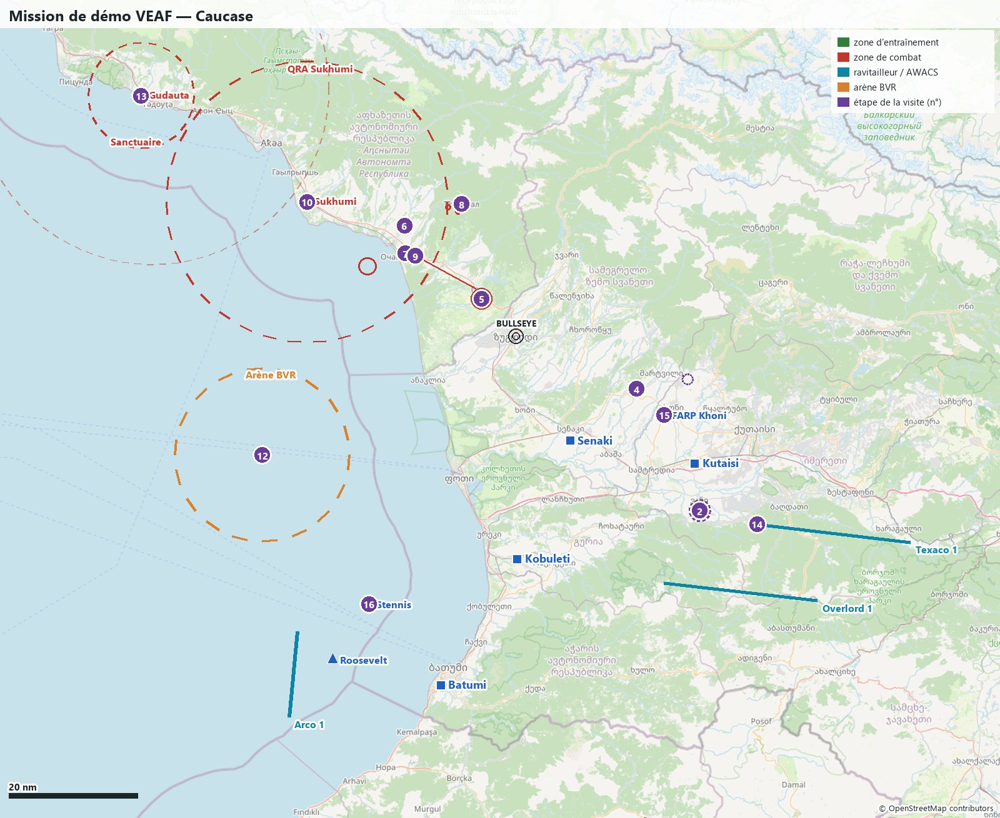

🇬🇧 *This document is also available [in English](README.en.md).*

# Mission de démo VEAF (Caucase)

La mission de démonstration des [VEAF Mission Creation Tools](https://github.com/VEAF/VEAF-Mission-Creation-Tools) v6 : **chaque fonctionnalité y a son exemple**, et une **visite guidée** en jeu mène de l'une à l'autre.
Elle est mise à jour à chaque nouvelle fonctionnalité, et vérifiée avant chaque release des outils : si une fonctionnalité marche ici, elle marche.

### Les VMCT, c'est quoi ?

Les **VEAF Mission Creation Tools** (VMCT) sont la boîte à outils avec laquelle la [VEAF](https://www.veaf.org) construit ses missions DCS World.
Elles apportent les scripts qui tournent en jeu (unités créées depuis un marqueur de la carte F10, zones de combat, QRA, CAP à la demande, ravitailleurs et AWACS, opérations porte-avions, défense aérienne Skynet, CTLD et CSAR…) et l'outil en ligne de commande `veaf-tools`, qui construit une mission à partir d'un dossier : la mission DCS, un `mission.yaml` qui règle chaque module, les préréglages radio, les points de navigation, les variantes météo.
[Documentation](https://veaf.github.io/documentation/latest/) · [Dépôt](https://github.com/VEAF/VEAF-Mission-Creation-Tools)



## Démarrer

1. Téléchargez la mission dans la langue et la météo de votre choix (dernière [release](https://github.com/VEAF/VEAF-Demo-Mission-v6/releases/latest)), et copiez-la dans `Saved Games\DCS\Missions` ; ou construisez-la (voir [Pour les créateurs de mission](#pour-les-créateurs-de-mission)).
2. Lancez-la en solo ou sur un serveur, et prenez un slot à **Kutaisi** (slots classiques, moteur chaud) ou sur un porte-avions.
3. Ouvrez le menu **F10 > Autre > Visite guidée** : un sous-menu par chapitre, une entrée par étape. Chaque entrée affiche ce qu'il faut faire, la position de l'étape par rapport à vous, et pose un repère sur votre carte F10.

La sécurité VEAF est **désactivée** dans cette mission : toutes les commandes sont ouvertes à tous, y compris celles qu'un serveur réserve aux pilotes habilités.
La mission existe en **deux versions complètes**, française (`_FR`) et anglaise (`_EN`) : menus VEAF et CTLD, visite guidée, menus de la démo, briefing, carte F10 et cartes du briefing sont dans la langue de la version.
Seuls CSAR et Skynet, qui n'ont pas de traduction, gardent des messages en anglais dans la version française, ainsi que quelques libellés VEAF pas encore traduits.

| Météo | Français | Anglais |
|---|---|---|
| matin, météo réelle de Kutaisi | [matin-reel_FR.miz](https://github.com/VEAF/VEAF-Demo-Mission-v6/releases/latest/download/VEAF_Demo_Mission_Caucasus_ICAO_UGKO_FR_matin-reel.miz) | [morning-real_EN.miz](https://github.com/VEAF/VEAF-Demo-Mission-v6/releases/latest/download/VEAF_Demo_Mission_Caucasus_ICAO_UGKO_EN_morning-real.miz) |
| matin, ciel clair | [matin-degage_FR.miz](https://github.com/VEAF/VEAF-Demo-Mission-v6/releases/latest/download/VEAF_Demo_Mission_Caucasus_ICAO_UGKO_FR_matin-degage.miz) | [morning-clear_EN.miz](https://github.com/VEAF/VEAF-Demo-Mission-v6/releases/latest/download/VEAF_Demo_Mission_Caucasus_ICAO_UGKO_EN_morning-clear.miz) |
| aube, nuages épars | [aube-epars_FR.miz](https://github.com/VEAF/VEAF-Demo-Mission-v6/releases/latest/download/VEAF_Demo_Mission_Caucasus_ICAO_UGKO_FR_aube-epars.miz) | [dawn-scattered_EN.miz](https://github.com/VEAF/VEAF-Demo-Mission-v6/releases/latest/download/VEAF_Demo_Mission_Caucasus_ICAO_UGKO_EN_dawn-scattered.miz) |
| soir, pluie | [soir-pluie_FR.miz](https://github.com/VEAF/VEAF-Demo-Mission-v6/releases/latest/download/VEAF_Demo_Mission_Caucasus_ICAO_UGKO_FR_soir-pluie.miz) | [evening-rain_EN.miz](https://github.com/VEAF/VEAF-Demo-Mission-v6/releases/latest/download/VEAF_Demo_Mission_Caucasus_ICAO_UGKO_EN_evening-rain.miz) |
| nuit, ciel clair | [nuit-degage_FR.miz](https://github.com/VEAF/VEAF-Demo-Mission-v6/releases/latest/download/VEAF_Demo_Mission_Caucasus_ICAO_UGKO_FR_nuit-degage.miz) | [night-clear_EN.miz](https://github.com/VEAF/VEAF-Demo-Mission-v6/releases/latest/download/VEAF_Demo_Mission_Caucasus_ICAO_UGKO_EN_night-clear.miz) |

### Taper une commande dans un marqueur

Beaucoup de fonctionnalités se commandent depuis la carte F10 : bouton « Ajouter un repère » dans la barre du haut, clic sur la carte, tapez le texte de la commande (par exemple `-sa8`), puis cliquez ailleurs pour valider.
La commande s'exécute à l'emplacement du marqueur, et le marqueur disparaît.

## Le théâtre

Le front suit l'Inguri, entre la Géorgie (bleue) et l'Abkhazie (rouge). Le bullseye, commun aux deux camps, est sur **Zugdidi**.

| Base bleue | Slots | Remarque |
|---|---|---|
| Kutaisi | classiques (moteur chaud) + dynamiques | base mère, défendue par un NASAMS |
| Senaki-Kolkhi | dynamiques | défendue par un Hawk ; cible du raid scénarisé |
| Kobuleti | dynamiques | |
| Batumi | dynamiques | |
| Porte-avions Stennis, Roosevelt | F/A-18C, F-14B (pont, moteur chaud) | au large de Batumi |
| FARP Khoni | — | hélicoptères, CTLD, CSAR |

Tous les aérodromes russes et abkhazes sont rouges, sans slot. Les dynamiques ne marchent qu'en multijoueur.

| Moyen | Fréquence | TACAN | Altitude | Où |
|---|---|---|---|---|
| Texaco 1 (KC-135, perche) | 292.0 AM | 52Y | FL200 | est de Kutaisi |
| Arco 1 (KC-135 MPRS, panier) | 291.0 AM | 51Y | FL180 | au sud des porte-avions |
| Overlord 1 (E-3A) + escorte F-15C | 286.0 AM | — | FL300 | sud de Kutaisi |
| Reaper 1 (MQ-9, JTAC laser 1511) | 35.55 FM | — | 3 000 m sol | front de Gali |
| CVN-74 Stennis | 274.0 AM | 74X STN, ICLS 4, Link 4 336.0 | — | au large de Batumi |
| CVN-71 Roosevelt | 271.0 AM | 71X TDR, ICLS 1, Link 4 337.0 | — | au large de Batumi |
| FARP Khoni | 127.5 AM | — | — | sud-ouest de Khoni |

## La visite guidée

| # | Étapes | Où | Fonctionnalités |
|---|---|---|---|
| 01 | [Bienvenue](#01-bienvenue) | Partout (pas de lieu particulier) | `RADIO`, `build:dynamic_slots`, `build:presets`, `build:waypoints`, `build:weather` |
| 02 | [Bac à sable : les commandes de marqueur](#02-bac-à-sable--les-commandes-de-marqueur) | BULLSEYE 127/40 — 7 nm de Kutaisi | `SPAWN`, `SHORTCUTS`, `NAMEDPOINTS`, `GRASS` |
| 03 | [Missions générées : CAS et transport](#03-missions-générées--cas-et-transport) | BULLSEYE 127/40 — 7 nm de Kutaisi | `CASMISSION`, `TRANSPORTMISSION`, `GROUNDAI` |
| 04 | [Entraînement de Khoni : trois niveaux](#04-entraînement-de-khoni--trois-niveaux) | BULLSEYE 107/21 — 13 nm de Senaki-Kolkhi | `COMBATZONE`, `AIEN` |
| 05 | [Front de Gali, et le drone JTAC](#05-front-de-gali-et-le-drone-jtac) | BULLSEYE 312/8 — 26 nm de Senaki-Kolkhi | `COMBATZONE`, `ASSETS`, `CTLD` |
| 06 | [Défense aérienne intégrée (Skynet)](#06-défense-aérienne-intégrée-skynet) | BULLSEYE 309/24 — 42 nm de Senaki-Kolkhi | `SKYNET`, `INTERPRETER`, `COMBATZONE` |
| 07 | [Mission chaînée : le port d'Ochamchire](#07-mission-chaînée--le-port-dochamchire) | BULLSEYE 301/21 — 39 nm de Senaki-Kolkhi | `COMBATZONE` |
| 08 | [Opération Tkvarcheli : tâches et dépendances](#08-opération-tkvarcheli--tâches-et-dépendances) | BULLSEYE 332/22 — 40 nm de Senaki-Kolkhi | `COMBATZONE` |
| 09 | [Convoi en mouvement](#09-convoi-en-mouvement) | BULLSEYE 303/20 — 38 nm de Senaki-Kolkhi | `COMBATZONE` |
| 10 | [QRA de Soukhoumi](#10-qra-de-soukhoumi) | BULLSEYE 297/39 — 55 nm de Senaki-Kolkhi | `QRA`, `RADIO` |
| 11 | [CAP à la demande et raid sur Senaki](#11-cap-à-la-demande-et-raid-sur-senaki) | BULLSEYE 297/69 — 85 nm de Senaki-Kolkhi | `COMBATMISSION` |
| 12 | [Arène BVR (vagues aériennes)](#12-arène-bvr-vagues-aériennes) | BULLSEYE 239/44 — 43 nm de Kobuleti | `AIRWAVES`, `RADIO` |
| 13 | [Sanctuaire rouge de Gudauta](#13-sanctuaire-rouge-de-gudauta) | BULLSEYE 297/69 — 85 nm de Senaki-Kolkhi | `SANCTUARY` |
| 14 | [Ravitailleurs, AWACS et escorte](#14-ravitailleurs-awacs-et-escorte) | BULLSEYE 122/48 — 14 nm de Kutaisi (au départ de la mission) | `ASSETS`, `MOVE` |
| 15 | [Hélicoptères : FARP, CTLD, CSAR](#15-hélicoptères--farp-ctld-csar) | BULLSEYE 112/26 — 9 nm de Kutaisi | `CTLD`, `CSAR`, `GRASS` |
| 16 | [Porte-avions Stennis et Roosevelt](#16-porte-avions-stennis-et-roosevelt) | BULLSEYE 203/48 — 17 nm de Batumi (au départ de la mission) | `CARRIER` |
| 17 | [Météo, ATC et assistance cockpit](#17-météo-atc-et-assistance-cockpit) | BULLSEYE 119/34 — 0 nm de Kutaisi | `WEATHER`, `AIRBASES`, `ASSIST`, `STTS`, `build:weather` |

### 1. Prise en main

#### 01 Bienvenue

Cette mission montre chaque fonctionnalité des outils VEAF, une par étape.
Chaque étape donne le lieu, ce qu'il faut faire et ce qu'on doit voir.
Un repère est posé sur votre carte F10 quand vous ouvrez une étape.

**Où** : Partout (pas de lieu particulier)

**À faire** :

- Les menus VEAF sont dans F10 > Autre > VEAF ; ce menu a plusieurs pages (« Page suivante » en bas). La visite guidée et le menu « Démo : commandes » sont à part, directement dans F10 > Autre.
- Beaucoup de commandes se tapent dans un marqueur de la carte F10 : bouton « Ajouter un repère » de la barre du haut, clic sur la carte, tapez le texte, puis cliquez ailleurs pour valider.
- Slots : à Kutaisi, des slots classiques moteur chaud (A-10C II, F-16C, F/A-18C, UH-1H, Mi-8, AH-64D), et des slots dynamiques sur les quatre bases bleues en multijoueur ; sur les porte-avions, F/A-18C et F-14B.

**Ce qu'on doit voir** : Le menu VEAF, ses sous-menus, et dans chaque avion les préréglages radio et les points de navigation injectés par le build.

**Fonctionnalités** : `RADIO`, `build:dynamic_slots`, `build:presets`, `build:waypoints`, `build:weather` — [Documentation](https://veaf.github.io/documentation/latest/mission-maker/GUIDE/)

#### 02 Bac à sable : les commandes de marqueur

Le bac à sable, au sud de Kutaisi (point nommé ALPHA), sert à essayer les commandes qu'on tape dans un marqueur F10 : faire apparaître des unités, un convoi, de la fumée, un FARP, et tout effacer.

**Où** : BULLSEYE 127/40 — 7 nm de Kutaisi

**À faire** :

- `-sa8` : une batterie SA-8 (alias livré ; liste complète dans la documentation des raccourcis).
- `-armor` : un groupe blindé tiré au sort ; `-armor, size 4, defense 0` pour le régler.
- `_spawn unit, name T-80UD, hdg 270` : un char isolé, cap 270.
- `-convoy, dest ALPHA` : un convoi qui rejoint le point nommé ALPHA par la route (posez le marqueur à quelques km).
- `-point BRAVO` : crée votre propre point nommé (alias de `_name point BRAVO`), réutilisable dans `-convoy, dest BRAVO`.
- `-smoke` : une fumée blanche (`-smoke, color red` pour du rouge) ; `-farp` : un FARP complet avec son décor.
- `-boum` : une explosion de 500 kg ; `-menage` : détruit tout dans un rayon de 2 km (deux raccourcis propres à cette mission).

**Ce qu'on doit voir** : Chaque commande répond par un message et fait apparaître ce qu'elle annonce à l'emplacement du marqueur ; le marqueur disparaît une fois la commande exécutée.

**Fonctionnalités** : `SPAWN`, `SHORTCUTS`, `NAMEDPOINTS`, `GRASS` — [Documentation](https://veaf.github.io/documentation/latest/mission-maker/scripts/veafSpawn/)

#### 03 Missions générées : CAS et transport

Deux commandes fabriquent une mission complète là où vous posez le marqueur : un appui aérien rapproché (CAS) ou un transport héliporté.

**Où** : BULLSEYE 127/40 — 7 nm de Kutaisi

**À faire** :

- `_cas` (ou `_cas, size 3, defense 2`) dans un marqueur du bac à sable : un groupe ennemi apparaît dans la zone, à trouver et détruire.
- Menu F10 > Autre > VEAF > MISSION CAS : informations sur la cible, fumée, éclairage, passer l'objectif.
- `_transport, from ALPHA` dans un marqueur posé près du FARP Khoni (à plus de 15 km d'ALPHA) : des caisses à prendre à ALPHA et à livrer au marqueur.
- Menu F10 > Autre > VEAF > MISSION DE TRANSPORT : position de la zone de livraison, fumée.

**Ce qu'on doit voir** : Un menu propre à la mission générée, et un message quand l'objectif est atteint.

**Fonctionnalités** : `CASMISSION`, `TRANSPORTMISSION`, `GROUNDAI` — [Documentation](https://veaf.github.io/documentation/latest/mission-maker/scripts/veafCasMission/)

### 2. Zones de combat

#### 04 Entraînement de Khoni : trois niveaux

Une zone d'entraînement en trois niveaux posés sur le même cercle.
Chaque niveau inclut le précédent : le moyen fait apparaître les cibles du facile en plus des siennes, le difficile celles du moyen.

**Où** : BULLSEYE 107/21 — 13 nm de Senaki-Kolkhi

**À faire** :

- Menu F10 > Autre > VEAF > ZONES DE COMBAT > Entraînement Khoni > Khoni - facile > Activer la zone.
- Détruisez les camions, puis désactivez et passez au niveau moyen, puis au difficile.
- Infos de la zone, fumée et fusée éclairante dans le même menu.

**Ce qu'on doit voir** : Facile : huit camions.
Moyen : les camions, une compagnie blindée et deux pièces de DCA tirées parmi quatre (jamais les mêmes d'une fois sur l'autre).
Difficile : en plus, un bataillon blindé et deux systèmes courte portée tirés au sort.

**Fonctionnalités** : `COMBATZONE`, `AIEN` — [Documentation](https://veaf.github.io/documentation/latest/mission-maker/scripts/veafCombatZone/)

#### 05 Front de Gali, et le drone JTAC

Une vraie zone de combat sur le front de l'Inguri.
Son contenu est décrit par des unités-porteuses qui portent une commande (#command) : la zone fait apparaître à leur place un groupe blindé tiré au sort parmi deux, une batterie d'artillerie, une DCA et des MANPADS.
Le drone Reaper 1 orbite au-dessus et désigne les blindés au laser.

**Où** : BULLSEYE 312/8 — 26 nm de Senaki-Kolkhi

**À faire** :

- Menu F10 > Autre > VEAF > ZONES DE COMBAT > Front de Gali > +Activer la zone.
- Le JTAC : code laser 1511, radio 35.55 FM ; menu F10 > Autre > CTLD > JTAC pour la cible en cours.
- Le drone est relançable depuis F10 > Autre > VEAF > MOYENS > Reaper 1 (MQ-9, JTAC).

**Ce qu'on doit voir** : Un seul des deux groupes blindés apparaît ; le drone annonce sa cible et la désigne au code 1511.

**Fonctionnalités** : `COMBATZONE`, `ASSETS`, `CTLD` — [Documentation](https://veaf.github.io/documentation/latest/mission-maker/concepts/combat-zones/)

#### 06 Défense aérienne intégrée (Skynet)

Le réseau de défense aérienne rouge : un radar d'alerte, un SA-11 et un SA-15 permanents près de Gudauta (posés par #veafInterpreter), plus le SA-6 d'Ochamchire, une zone de combat active dès le démarrage qui rejoint le réseau.
Les batteries gardent leur radar éteint et ne l'allument que quand le réseau le leur demande.
Les unités au sol rouges servent de guetteurs : elles voient les avions et relaient l'alerte.

**Où** : BULLSEYE 309/24 — 42 nm de Senaki-Kolkhi

**À faire** :

- Approchez Ochamchire par le sud-est, à basse altitude puis en montant : regardez quand votre RWR s'allume.
- L'état de l'IADS rouge (sites, radars allumés) : F10 > Autre > SKYNET IADS COALITION: RED.
- La vue des guetteurs est propre à chaque camp : F10 > Autre > VEAF > RÉSEAU DE GUETTEURS > Afficher la vue des guetteurs montre les guetteurs de VOTRE camp. Pour voir le réseau rouge, prenez le slot game master rouge de la mission de test (rouvrez la carte F10 après le clic).

**Ce qu'on doit voir** : Le SA-6 n'émet pas tant que le réseau ne vous a pas détecté, puis s'allume ; le menu SKYNET IADS COALITION: RED montre quel site émet.

**Fonctionnalités** : `SKYNET`, `INTERPRETER`, `COMBATZONE` — [Documentation](https://veaf.github.io/documentation/latest/mission-maker/scripts/veafSkynetIadsHelper/)

#### 07 Mission chaînée : le port d'Ochamchire

Deux zones enchaînées : la seconde n'existe pas tant que la première n'est pas terminée.
D'abord le dépôt du port, puis, une minute après sa destruction, les cargos et leur corvette en rade (lutte antinavire).

**Où** : BULLSEYE 301/21 — 39 nm de Senaki-Kolkhi

**À faire** :

- Menu F10 > Autre > VEAF > ZONES DE COMBAT > Port d'Ochamchire - 1 : dépôt > +Activer la zone.
- Détruisez les camions et la ZU-23, puis attendez une minute.

**Ce qu'on doit voir** : La zone 1 se termine, et les navires apparaissent au large sans qu'aucun menu ne les ait activés.
Attention : le cercle de la QRA de Soukhoumi couvre Ochamchire.

**Fonctionnalités** : `COMBATZONE` — [Documentation](https://veaf.github.io/documentation/latest/mission-maker/scripts/veafCombatZone/)

#### 08 Opération Tkvarcheli : tâches et dépendances

Une opération regroupe plusieurs zones en tâches : le radar et le dépôt d'abord, puis le poste de commandement, qui n'est donné comme objectif qu'une fois les deux premiers détruits.
Toutes les unités apparaissent à l'activation : la dépendance ordonne les objectifs, pas l'apparition.

**Où** : BULLSEYE 332/22 — 40 nm de Senaki-Kolkhi

**À faire** :

- Menu F10 > Autre > VEAF > ZONES DE COMBAT > Opération Tkvarcheli > +Activer la zone : les trois tâches apparaissent ensemble.
- Le même menu donne la tâche en cours ; détruisez le radar 1L13 et le dépôt (statiques), puis le PC.

**Ce qu'on doit voir** : Les tâches passent de « en cours » à « terminée » ; quand les trois sont faites, le message « L'opération … est terminée ».

**Fonctionnalités** : `COMBATZONE` — [Documentation](https://veaf.github.io/documentation/latest/mission-maker/scripts/veafCombatZone/)

#### 09 Convoi en mouvement

Un convoi logistique, cinq camions et sa Shilka, qui fait la navette entre Ochamchire et Gali : une cible qui bouge.

**Où** : BULLSEYE 303/20 — 38 nm de Senaki-Kolkhi

**À faire** :

- Menu F10 > Autre > VEAF > ZONES DE COMBAT > Convoi d'Ochamchire > +Activer la zone.
- Infos de la zone : la position du convoi au moment de la demande.

**Ce qu'on doit voir** : Le convoi roule vers Gali, puis revient, en boucle.

**Fonctionnalités** : `COMBATZONE` — [Documentation](https://veaf.github.io/documentation/latest/mission-maker/scripts/veafCombatZone/)

### 3. Menace aérienne

#### 10 QRA de Soukhoumi

Une alerte en vol (QRA) défend Soukhoumi dans un cercle de 40 km, qui couvre Ochamchire.
Elle répond à la menace : un intrus fait décoller une paire tirée au sort entre MiG-29S et Su-27 ; trois intrus ou plus, deux paires parmi Su-30, MiG-31 et MiG-29S.
Elle ne réagit pas aux hélicoptères.

**Où** : BULLSEYE 297/39 — 55 nm de Senaki-Kolkhi

**À faire** :

- Entrez dans le cercle (dessiné sur la carte F10) avec un avion : la QRA décolle 60 s plus tard.
- Menu F10 > Autre > Démo : commandes > Arrêter / Démarrer la QRA de Soukhoumi (menu déclaré en YAML).

**Ce qu'on doit voir** : Un message annonce le décollage ; les chasseurs viennent vers vous.
Une fois la QRA détruite, elle se réarme 5 minutes après que le cercle s'est vidé d'intrus.

**Fonctionnalités** : `QRA`, `RADIO` — [Documentation](https://veaf.github.io/documentation/latest/mission-maker/scripts/veafQraManager/)

#### 11 CAP à la demande et raid sur Senaki

Des patrouilles rouges qu'on fait apparaître depuis le menu, de menaces différentes (MiG-29S Fox 3, Su-27 Fox 1, MiG-31), et une mission scénarisée : deux Su-24M escortés par deux MiG-29S partent bombarder Senaki.

**Où** : BULLSEYE 297/69 — 85 nm de Senaki-Kolkhi

**À faire** :

- Menu F10 > Autre > VEAF > MISSIONS > CAP MiG-29S Gudauta FL250 > Good > scale 1 > Activer la mission ; même menu pour le niveau Excellent et la taille scale 2.
- Menu F10 > Autre > VEAF > MISSIONS > Raid sur Senaki > Good > scale 1 > Activer la mission, puis interceptez les bombardiers.
- Ou par marqueur : `-airstart Raid-Senaki/Good/1`, `-airstop Raid-Senaki/Good/1` (nom, niveau, taille).

**Ce qu'on doit voir** : La patrouille apparaît en vol sur son hippodrome et engage ce qui entre à portée ; le raid vole vers Senaki et bombarde la base s'il n'est pas intercepté.

**Fonctionnalités** : `COMBATMISSION` — [Documentation](https://veaf.github.io/documentation/latest/mission-maker/scripts/veafCombatMission/)

#### 12 Arène BVR (vagues aériennes)

Une arène au large de Poti : dès qu'un avion bleu y entre, des vagues de chasseurs rouges arrivent l'une après l'autre, de plus en plus dures (MiG-29S seul, deux Su-27, deux Su-30).

**Où** : BULLSEYE 239/44 — 43 nm de Kobuleti

**À faire** :

- Entrez dans le cercle de l'arène (dessiné sur la carte F10), entre 1 000 et 40 000 ft.
- Pour recommencer : F10 > Autre > Démo : commandes > Relancer l'arène BVR.

**Ce qu'on doit voir** : Message de début, puis une vague ; la suivante arrive une minute après la destruction de la précédente.
Si vous mourez, l'arène se réinitialise.

**Fonctionnalités** : `AIRWAVES`, `RADIO` — [Documentation](https://veaf.github.io/documentation/latest/mission-maker/scripts/veafAirWaves/)

#### 13 Sanctuaire rouge de Gudauta

Un sanctuaire protège une zone pour un camp : un pilote adverse qui y entre est averti, puis une défense apparaît, puis il est abattu.
Celui-ci protège Gudauta (15 km) côté rouge ; il détruit aussi les missiles tirés sur les unités qui s'y trouvent.

**Où** : BULLSEYE 297/69 — 85 nm de Senaki-Kolkhi

**À faire** :

- Entrez dans le cercle de Gudauta avec un avion bleu et restez-y.

**Ce qu'on doit voir** : Avertissement après 10 s, défense déployée à 60 s, avion abattu à 120 s.

**Fonctionnalités** : `SANCTUARY` — [Documentation](https://veaf.github.io/documentation/latest/mission-maker/scripts/veafSanctuary/)

### 4. Soutien et logistique

#### 14 Ravitailleurs, AWACS et escorte

Deux ravitailleurs (Texaco 1 à perche, Arco 1 à panier) et un AWACS (Overlord 1) escorté par deux F-15C.
Le menu MOYENS les relance et donne leurs informations ; une commande de marqueur déplace un ravitailleur.

**Où** : BULLSEYE 122/48 — 14 nm de Kutaisi (au départ de la mission)

**À faire** :

- Texaco 1 : TACAN 52Y, 292.0 AM, FL200 ; Arco 1 : TACAN 51Y, 291.0 AM, FL180 ; Overlord 1 : 286.0 AM.
- Menu F10 > Autre > VEAF > MOYENS > Overlord 1 (E-3A) > Réapparition de Overlord 1 (E-3A) : l'AWACS et son escorte réapparaissent ensemble.
- Marqueur `_move tanker, name Texaco 1, alt 22000` posé où vous voulez l'hippodrome.

**Ce qu'on doit voir** : Les ravitailleurs répondent sur leur fréquence et leur TACAN ; après un _move tanker, Texaco 1 rejoint sa nouvelle orbite.

**Fonctionnalités** : `ASSETS`, `MOVE` — [Documentation](https://veaf.github.io/documentation/latest/mission-maker/scripts/veafAssets/)

#### 15 Hélicoptères : FARP, CTLD, CSAR

Le FARP Khoni réarme et ravitaille les hélicoptères ; son dépôt de munitions est un point de chargement CTLD (troupes et caisses).
Un pilote abattu peut être créé à la demande, à aller chercher en hélicoptère (CSAR).

**Où** : BULLSEYE 112/26 — 9 nm de Kutaisi

**À faire** :

- Décollez de Kutaisi en UH-1H ou Mi-8 et posez-vous au FARP Khoni (127.5 AM).
- Menu F10 > Autre > CTLD : charger des troupes, demander une caisse, puis les déposer ailleurs.
- Menu F10 > Autre > Démo : commandes > Créer un pilote abattu près de Khoni, puis menu CSAR pour sa balise et sa position.

**Ce qu'on doit voir** : Le FARP ravitaille et réarme ; CTLD charge les troupes ; le pilote abattu émet une balise et se laisse embarquer.

**Fonctionnalités** : `CTLD`, `CSAR`, `GRASS` — [Documentation](https://veaf.github.io/documentation/latest/mission-maker/GUIDE/)

#### 16 Porte-avions Stennis et Roosevelt

Deux porte-avions au large de Batumi, chacun avec son ravitailleur S-3B et son hélicoptère de sauvetage.
Le menu OPS PORTE-AVIONS met le navire face au vent pour les opérations aériennes.

**Où** : BULLSEYE 203/48 — 17 nm de Batumi (au départ de la mission)

**À faire** :

- Stennis : TACAN 74X STN, ICLS 4, Link 4 336.0, tour 274.0 AM. Roosevelt : TACAN 71X TDR, ICLS 1, Link 4 337.0, tour 271.0 AM.
- Menu F10 > Autre > VEAF > OPS PORTE-AVIONS > OPS PORTE-AVIONS - BLEU > CSG-74 Stennis > +Démarrer les opérations aériennes pour 45 minutes.
- Slots de pont : Stennis F/A-18C, Roosevelt F-14B.

**Ce qu'on doit voir** : Le porte-avions vire face au vent, accélère, et le menu donne le cap de récupération ; le S-3B ravitaille.

**Fonctionnalités** : `CARRIER` — [Documentation](https://veaf.github.io/documentation/latest/mission-maker/scripts/veafCarrierOperations/)

#### 17 Météo, ATC et assistance cockpit

Un message d'accueil à la prise de slot (base, piste en service, météo), un menu météo et ATC, et pour le F-16C une checklist de démarrage pas à pas.
Sur un serveur VEAF, la météo suit la METAR réelle de Kutaisi (UGKO).

**Où** : BULLSEYE 119/34 — 0 nm de Kutaisi

**À faire** :

- Prenez un slot à Kutaisi : lisez le message d'accueil.
- Menu F10 > Autre > VEAF > MÉTÉO ET ATC > Météo sur le point le plus proche ; dans le même menu, ATC de la base la plus proche.
- En F-16C à Kutaisi : F10 > Autre > VEAF > ASSISTANCE > Démarrage à froid ; ensuite, à la racine du menu VEAF : ASSISTANCE : VALIDER L'ÉTAPE / PASSER L'ÉTAPE.

**Ce qu'on doit voir** : Le message d'accueil donne la piste en service ; la checklist coche les étapes déjà faites.

**Fonctionnalités** : `WEATHER`, `AIRBASES`, `ASSIST`, `STTS`, `build:weather` — [Documentation](https://veaf.github.io/documentation/latest/mission-maker/scripts/veafWeather/)

## Pour les créateurs de mission

### Construire

Depuis ce dossier, avec `veaf-tools.exe` (installé par `veaf-tools-updater.exe`, voir la [documentation](https://veaf.github.io/documentation/latest/)) :

```
.\veaf-tools.exe mission validate
.\veaf-tools.exe build
python tools/localize_miz.py
python tools/verify.py
```

`build` construit les deux langues (`build_variants` de `mission.yaml`) : dans `missions/`, une mission `_FR` et une `_EN` par variante météo de `src/versions.yaml`.
`localize_miz.py` met ensuite en anglais ce qui vit dans la mission DCS des versions `_EN` (briefing, étiquettes F10, cartes du briefing) : sans lui, `verify.py` refuse les `.miz` anglais.
Pour un test local (logs détaillés, une seule météo, game masters, pont dcs-bridge) : `python tools/make_test_mission.py`, qui produit `missions-test/VEAF_Demo_TEST_FR.miz` et `_EN.miz`.

### Les fichiers

| Fichier | Rôle |
|---|---|
| `mission.yaml` | la configuration de tous les modules VEAF, textes en français ; sa fin (profils FR et EN, `build_variants`) est **générée** |
| `i18n/en.yaml` | la version anglaise de chaque texte de `mission.yaml` |
| `src/mission/` | la mission DCS elle-même, éclatée, en français |
| `src/scripts/mission-script.lua` | le Lua propre à la mission (fonction du menu « Démo : commandes ») |
| `src/scripts/guided-tour.lua` | la visite guidée, **générée** ; elle suit la langue du build |
| `tour/steps.yaml` | **la source** de la visite, de ce README et de la recette, en français et en anglais |
| `tools/` | les générateurs : lots d'actions MCP (`gen_0*.py`), visite et docs (`gen_tour.py`), profil anglais (`gen_i18n.py`), cartes (`gen_map.py`), textes de la mission DCS dans les deux langues (`i18n_texts.py`), localisation des `.miz` anglais (`localize_miz.py`), vérification (`verify.py`) |
| `docs/recette.md` | la liste de contrôle avant release, **générée** |

### Ajouter une fonctionnalité

Chaque nouvelle fonctionnalité des outils VEAF ajoute son exemple à la démo, dans la même PR que la fonctionnalité ou juste après :

1. poser l'exemple dans la mission (actions MCP sur le dossier, ou `mission.yaml`) ;
2. ajouter son étape dans `tour/steps.yaml`, en français et en anglais, avec son contrôle de recette (`check`) ;
3. traduire tout nouveau texte de `mission.yaml` dans `i18n/en.yaml`, puis `python tools/gen_i18n.py` (il refuse de tourner s'il manque une traduction) ;
4. `python tools/gen_tour.py` (visite, README, recette) et `python tools/gen_map.py` (cartes) ;
5. construire, `python tools/localize_miz.py`, puis `python tools/verify.py`.

### Avant chaque release des outils

Construire la démo avec la version candidate et dérouler [la recette](docs/recette.md) : chaque ligne est un observable en jeu.
Une fois les outils publiés, `python tools/release.py published-v<version>` installe cette version, construit, localise, vérifie, et publie les dix `.miz` dans une release du dépôt.
